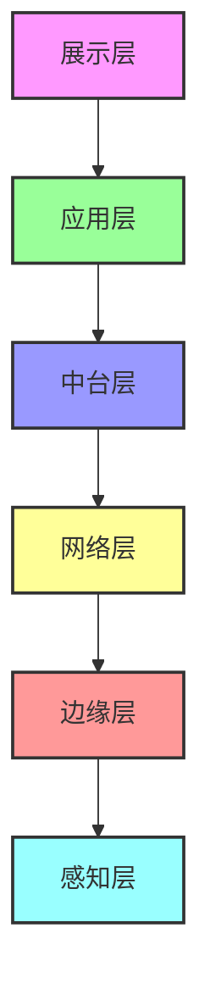
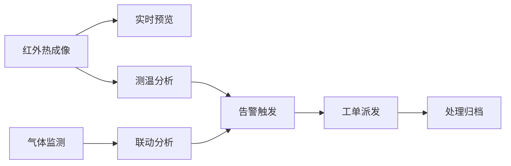
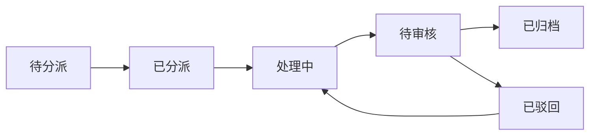
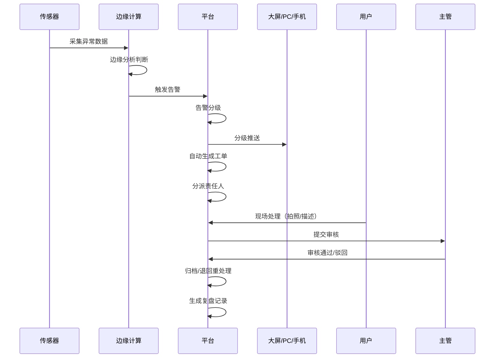
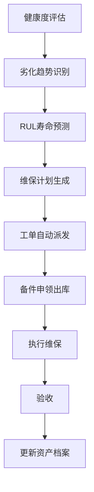

# 杜尔伯特城区热电联产设备数字化在线安全管理与资产管理平台
## 产品需求文档（PRD）
---
### 文档信息
| 项 | 内容 |
|-----|-----|
| 文档名称 | 杜尔伯特城区热电联产设备数字化在线安全管理与资产管理平台PRD |
| 文档版本 | V1.0 |
| 编写日期 | 2024年 |
| 编写人 | 产品部 |
| 审批人 | |
| 生效日期 | |
---
## 1. 产品概述
### 1.1 产品背景
#### 1.1.1 行业背景
随着国家"双碳"战略推进和工业互联网发展，热电联产企业正面临数字化转型的迫切需求。根据《电力安全生产"十四五"规划》要求，电力企业需加强设备状态监测和智能预警能力建设。杜尔伯特城区作为重要的供热供电区域，其热电联产设备的安全稳定运行直接关系到民生保障和区域经济发展。

#### 1.1.2 企业痛点
杜尔伯特城区热电联产企业面临设备安全管理和资产管理的多重挑战：
- **安全风险高**：煤场自燃、皮带火灾、设备过热等隐患发现晚、定位难
- **运维效率低**：人工巡检强度大、覆盖率低、数据不可靠
- **资产管理弱**：设备台账静态化、维保被动、资产不可视
- **系统孤岛多**：多系统数据孤立，无法对接国网/DCS/MES
- **流程不闭环**：安全隐患无闭环、无追溯、无量化

本平台旨在通过工业互联网技术，实现**煤场→输煤→主机辅机→电气设备**全链路数字化管控，替代人工巡检，降低非计划停机，保障供热与发电安全。
### 1.2 产品定位
面向**热电联产企业**的**设备状态在线监测 + 智能预警 + 预测性维护 + 全生命周期资产管理**一体化工业互联网平台。
实现：**煤场→输煤→主机辅机→电气设备**全链路数字化管控，替代人工巡检，降低非计划停机，保障供热与发电安全。
### 1.3 核心解决问题
| 问题类别 | 具体描述 | 影响程度 |
|---------|---------|---------|
| 安全隐患 | 煤场自燃、皮带火灾、设备过热**发现晚、定位难** | 极高 |
| 巡检问题 | 人工巡检强度大、覆盖率低、数据不可靠 | 高 |
| 资产管理 | 设备台账静态化、维保被动、资产不可视 | 高 |
| 系统对接 | 多系统数据孤岛，无法对接国网/DCS/MES | 中 |
| 流程管理 | 安全隐患无闭环、无追溯、无量化 | 中 |
### 1.4 产品目标
| 指标类别 | 具体目标 |
|---------|---------|
| 预警指标 | 预警准确率 ≥ 99%，隐患闭环率 100% |
| 效率指标 | 替代 ≥ 80% 人工巡检，运维成本下降 ≥ 60% |
| 可靠性指标 | 非计划停机降低 ≥ 90% |
| 管理目标 | 设备全生命周期可管、可视、可追溯 |
| 集成目标 | 支持标准接口对接，无信息孤岛 |
### 1.5 受众与使用场景
| 角色 | 使用场景 | 核心诉求 |
|------|----------|----------|
| 值长/集控员 | 实时监控、告警处理、联动确认 | 简单、直观、低时延、不误操作 |
| 点检/运维 | 工单接单、现场处置、拍照回传 | 移动化、一键操作、离线可用 |
| 设备主管 | 健康度、维保计划、资产台账 | 可量化、可闭环、可预测 |
| 安监 | 隐患预警、流程闭环、合规留痕 | 可追溯、可审计、可联动 |
| 信息科 | 对接、安全、稳定、扩展 | 标准协议、等保合规、不扰生产 |
| 管理层 | 驾驶舱、KPI、成本、决策 | 总览、趋势、同比环比 |

### 1.6 市场分析与竞品对比
#### 1.6.1 市场规模
根据《中国电力企业联合会数据，2023年全国热电联产设备监测市场规模达到120亿元，年复合增长率23.5%。其中，东北地区因冬季供热需求旺盛，市场潜力巨大。

#### 1.6.2 竞品分析
| 竞品 | 优势 | 劣势 | 我方优势 |
|-----|------|------|---------|
| 传统DCS厂商 | 行业积累深、DCS对接好 | 智能化程度低、资产管理弱 | 全链路覆盖、AI预警准 |
| 互联网平台厂商 | 技术先进、云架构 | 工业场景理解浅 | 工业级可靠性高、懂现场 |
| 单一传感器厂商 | 硬件成本低 | 无完整解决方案 | 一体化平台、闭环管理 |

#### 1.6.3 ROI分析
**投资回收期**：约18-24个月
**收益构成**：
- 运维成本降低：60%×年运维成本约200万，年节约120万
- 非计划停机减少：90%×年停机损失约500万，年节约450万
- 人工替代：80%×年人工成本约150万，年节约120万
**年总收益**：约690万元
---
## 2. 产品全局架构
### 2.1 六层架构设计

| 层级 | 组成部分 | 功能描述 |
|-----|---------|---------|
| **感知层** | 热成像、雷达、温振、RFID、光纤听诊、TDI相机 | 数据采集、设备感知 |
| **边缘层** | 边缘网关、边缘计算、本地告警、断点续传 | 本地处理、数据缓存、实时响应 |
| **网络层** | 工业以太网 + 管理网物理隔离，网闸隔离 | 安全传输、网络隔离 |
| **中台层** | 数据中台、AI算法中台、业务中台 | 数据处理、算法支撑、服务复用 |
| **应用层** | 6大子系统 | 业务功能实现 |
| **展示层** | 大屏、PC端、移动端、Web门户 | 用户交互展示 |
### 2.2 核心子系统
| 子系统编号 | 子系统名称 | 核心功能 |
|-----------|-----------|---------|
| S1 | 燃料监测管理子系统 | 煤场自燃监测、智能盘库 |
| S2 | 输煤设备监测子系统 | 设备测温、皮带缺陷AI检测 |
| S3 | 生产过程监测子系统 | 汽轮机监测、泵阀/电机/轴承温振监测 |
| S4 | 电力设备温度监测子系统 | 变压器、开关柜、电缆接头测温 |
| S5 | 智能预警与运维闭环子系统 | 三级预警、智能工单、智能巡检 |
| S6 | 全生命周期资产管理子系统 | 资产台账、健康度评估、预测性维护 |
### 2.3 外部系统对接矩阵
| 外部系统 | 对接方向 | 对接内容 | 协议 | 安全要求 |
|---------|---------|---------|------|---------|
| DCS/SIS | 双向 | 实时数据交互 | OPC UA | 网闸隔离 |
| MES/ERP | 双向 | 资产、维保、备件数据 | HTTP/HTTPS | 加密传输 |
| 国网调度平台 | 上行 | 电气温度、状态数据 | 国网标准协议 | 等保三级 |
| 燃料管理系统 | 双向 | 燃料数据同步 | Modbus TCP | 单向隔离 |
| 消防/安防系统 | 下行 | 单向告警输出 | 干接点/OPC | 单向传输 |
---
## 3. 功能需求详细设计
### 3.1 燃料监测管理子系统（S1）
#### 3.1.1 封闭煤场自燃监测
**功能模块图**

**功能点明细**
| 功能ID | 功能名称 | 功能描述 | 输入 | 输出 | 业务规则 |
|--------|---------|---------|------|------|---------|
| S1-101 | 全域红外热成像实时预览 | 展示煤场全域热成像画面 | 摄像头视频流 | 实时热成像画面 | 支持多画面切换 |
| S1-102 | 点/线/框测温 | 支持多种测温方式 | 用户选择测温区域 | 温度数据、温差值 | 测温精度：±2℃ |
| S1-103 | 全屏测温 | 自动检测全屏温度 | 热成像数据 | 最高温点位置及数值 | 轮巡周期 ≤ 5min |
| S1-104 | 高温自动预警 | 60℃高温自动触发预警 | 温度数据 | 告警信息、定位坐标 | 定位误差 ≤ 0.5m |
| S1-105 | 气体联动监测 | CO/SO₂/CH₄/H₂S气体监测 | 气体传感器数据 | 气体浓度值 | 多参量联动分析 |
| S1-106 | 历史数据查询 | 告警和历史曲线查询 | 时间范围 | 告警列表、趋势曲线 | 30天告警查询、1年历史曲线 |
| S1-107 | 告警闭环处理 | 自动派单到归档全流程 | 告警信息 | 工单状态、处理记录 | 100%闭环 |
**测点配置规则**
| 煤场类型 | 最小点位数量 | 安装要求 |
|---------|-------------|---------|
| 条形煤场 | ≥ 6点位 | 对角安装、全覆盖 |
| 圆形煤场 | ≥ 8点位 | 圆周均匀分布 |
#### 3.1.2 雷达堆料体积测量（智能盘库）
| 功能ID | 功能名称 | 功能描述 | 业务规则 |
|--------|---------|---------|---------|
| S1-201 | 3D点云建模 | 生成煤堆三维模型 | 多雷达数据拼接融合 |
| S1-202 | 自动盘库计算 | 体积/高度/质量计算 | 体积误差 ≤ 1% |
| S1-203 | 缺料/溢料报警 | 料位异常预警 | 可配置阈值 |
| S1-204 | 趋势统计 | 日/月/季/年统计分析 | 支持同比环比 |
**雷达选型规则**
| 环境条件 | 推荐类型 | 温度范围 |
|---------|---------|---------|
| 粉尘大 | 毫米波雷达 | ≤ 80℃ |
| 低粉尘 | 激光雷达 | ≤ 60℃ |
| 高温仓 | 耐高温雷达 | ≤ 150℃ |
### 3.2 输煤设备监测子系统（S2）
#### 3.2.1 输煤设备测温
| 功能ID | 功能名称 | 监测对象 | 功能描述 |
|--------|---------|---------|---------|
| S2-101 | 设备温度监测 | 碎煤机、电机、滚筒、落煤管、除尘器 | 实时温度采集 |
| S2-102 | 全屏温差报警 | 所有输煤设备 | 智能温差分析报警（免画框） |
| S2-103 | 多设备同屏对比 | 最多9台设备 | 同屏温度对比展示 |
| S2-104 | 历史温度分析 | 所有设备 | 温度趋势分析、告警工单联动 |
#### 3.2.2 皮带缺陷AI检测
| 功能ID | 功能名称 | 检测方式 | 性能指标 |
|--------|---------|---------|---------|
| S2-201 | 皮带火灾监测 | 热成像 | 响应时间 < 200ms |
| S2-202 | 皮带纵撕识别 | TDI+激光 | 准确率 ≥ 99% |
| S2-203 | 托辊异常识别 | 光纤听诊声纹 | 定位精度 ±3.5m |
| S2-204 | 多缺陷识别 | AI视觉 | 跑偏、堵料、异物、闯入 |
| S2-205 | 紧急联动停机 | 系统触发 | 需人工确认后执行 |
### 3.3 生产过程监测子系统（S3）
#### 3.3.1 汽轮机温度监测
| 功能ID | 功能名称 | 监测部位 | 功能描述 |
|--------|---------|---------|---------|
| S3-101 | 全域测温 | 轴承、电机、管道、碳刷 | 热成像全覆盖测温 |
| S3-102 | 双监测验证 | 所有部位 | 热成像 + RFID双监测 |
| S3-103 | 烟火识别 | 全域 | 烟火智能识别 |
| S3-104 | 超温定位 | 所有部位 | 精准定位超温位置 |
#### 3.3.2 泵阀/电机/轴承温振监测
**功能点**
| 功能ID | 功能名称 | 采集参数 | 性能指标 |
|--------|---------|---------|---------|
| S3-201 | 温振数据采集 | 三轴加速度/速度/位移 + 温度 | 采样频率 ≥ 10kHz |
| S3-202 | 轴承故障诊断 | 振动频谱 | 内圈/外圈/滚动体故障识别 |
| S3-203 | 健康度评分 | 多参量 | 综合健康评分 |
| S3-204 | 告警推送 | 异常数据 | 短信/APP推送 |
**硬件规格**
| 参数 | 规格要求 |
|-----|---------|
| 安装方式 | 磁吸安装 |
| 通信方式 | 无线433M |
| 防护等级 | IP67 |
| 防爆等级 | Ex ib II BT4 |
| 电池寿命 | ≥ 3年 |
| 传输距离 | ≤ 800m（空旷） |
### 3.4 电力设备温度监测子系统（S4）
| 功能ID | 功能名称 | 监测对象 | 技术特点 | 性能指标 |
|--------|---------|---------|---------|---------|
| S4-101 | 温度监测 | 变压器、高低压柜、环网柜、电缆接头 | RFID无源无线 | 精度 ±1℃ |
| S4-102 | 三级阈值报警 | 所有设备 | 声光/短信/APP报警 | 响应时间 ≤ 1s |
| S4-103 | 一次系统图展示 | 所有设备 | 可视化展示 | 实时更新 |
| S4-104 | 数据上报 | 所有设备 | 对接国网、DCS | 上报成功率 100% |
**硬件规格**
| 参数 | 规格要求 |
|-----|---------|
| 供电方式 | 无源、无电池 |
| 维护要求 | 免维护 |
| 防护等级 | IP68 |
| 抗干扰 | 抗强电磁 |
| 绝缘安全 | 无绝缘风险 |
### 3.5 智能预警与运维闭环子系统（S5）「核心」
#### 3.5.1 三级预警机制
**预警触发规则**：采用多参量融合判断，单一传感器异常触发预警，两个及以上相关传感器异常触发告警，存在安全风险（如温度≥85℃且持续升温）触发紧急告警。

| 预警级别 | 颜色标识 | 触发条件 | 处理时限 | 通知对象 | 联动动作 |
|---------|---------|---------|---------|---------|---------|
| 预警（一级） | 黄色 | 接近阈值或单一传感器轻微异常 | 24小时内关注 | 点检员 | 大屏提示、APP消息 |
| 告警（二级） | 橙色 | 超过阈值或两个传感器中度异常 | 4小时内处理 | 运维班长 | 自动派单、短信通知 |
| 紧急（三级） | 红色 | 严重异常或存在安全隐患 | 立即处理 | 值长/主管 | 声光报警、联动消防/停机（需人工确认） |

**告警抑制规则**：
- 同一设备同一类型告警，10分钟内不重复触发
- 支持告警屏蔽（设备检修期间）
- 支持告警合并（相关联告警合并展示）
#### 3.5.2 智能工单管理
**工单状态流转图**

| 功能ID | 功能名称 | 功能描述 | 业务规则 |
|--------|---------|---------|---------|
| S5-201 | 自动派单 | 按区域/角色自动分派 | 支持人工调整 |
| S5-202 | 移动端处理 | 接单、拍照、签字 | 支持离线操作 |
| S5-203 | 超时升级 | 超时未处理自动升级 | 可配置超时时间 |
| S5-204 | 备件关联 | 工单关联备品备件 | 支持出库申领 |
| S5-205 | 督办统计 | 工单督办、统计分析 | 支持多维度统计 |
#### 3.5.3 智能巡检
| 功能ID | 功能名称 | 功能描述 |
|--------|---------|---------|
| S5-301 | 巡检计划生成 | 按设备状态动态生成巡检计划 |
| S5-302 | 扫码巡检 | 设备二维码扫码巡检 |
| S5-303 | 异常转工单 | 巡检异常一键转工单 |
| S5-304 | 巡检统计 | 巡检率、发现率自动统计 |
### 3.6 全生命周期资产管理子系统（S6）「核心」
#### 3.6.1 资产台账（一物一码）
| 功能ID | 功能名称 | 信息类别 | 功能描述 |
|--------|---------|---------|---------|
| S6-101 | 静态信息管理 | 基础信息 | 型号、厂家、参数、图纸、文档 |
| S6-102 | 动态信息管理 | 实时数据 | 温度、振动、告警、维保、健康度 |
| S6-103 | 批量导入 | 台账管理 | 支持Excel批量导入 |
| S6-104 | ERP同步 | 数据对接 | 与ERP系统数据同步 |
#### 3.6.2 健康度评估模型
**评估算法**：温度 30% + 振动 30% + 告警 20% + 维保 10% + 年限 10%
**状态分级**
| 健康等级 | 分数区间 | 状态标识 | 处理策略 |
|---------|---------|---------|---------|
| 健康 | 90-100分 | 绿色 | 正常运行 |
| 亚健康 | 70-89分 | 黄色 | 关注、增加巡检 |
| 异常 | 50-69分 | 橙色 | 计划维保 |
| 故障 | <50分 | 红色 | 立即停机检修 |
#### 3.6.3 预测性维护
| 功能ID | 功能名称 | 功能描述 |
|--------|---------|---------|
| S6-301 | RUL剩余寿命预测 | 基于AI算法预测设备剩余使用寿命 |
| S6-302 | 维保计划生成 | 自动生成维保计划 |
| S6-303 | 工单自动派发 | 维保到期自动派发工单 |
| S6-304 | 维保记录管理 | 完整维保记录归档 |
#### 3.6.4 资产合规与绩效
| 功能ID | 功能名称 | 功能描述 |
|--------|---------|---------|
| S6-401 | 折旧计算 | 自动计算资产折旧 |
| S6-402 | 绩效指标统计 | 设备可用率、停机时长、维保成本 |
| S6-403 | 校验提醒 | 设备校验、年检到期提醒 |
| S6-404 | 合规管理 | 合规性检查、审计追踪 |
---
## 4. 非功能需求（NFR）
### 4.1 性能指标
| 指标类别 | 性能要求 | 测量方法 | 备注 |
|---------|---------|---------|------|
| 系统可用性 | ≥ 99.9% | 月度统计 | 计划停机除外 |
| 告警响应时间 | ≤ 1s | 端到端测试 | 传感器触发到平台展示 |
| 数据接入延迟 | ≤ 2s | 传感器到平台 | 含边缘计算处理时间 |
| 页面加载时间 | ≤ 3s | 首屏加载 | 50Mbps带宽下 |
| 并发用户数 | ≥ 100人 | 压力测试 | 正常业务操作无卡顿 |
| 历史数据保存 | ≥ 5年 | 在线存储 | 热数据1年，冷数据5年 |
| 日志保存 | ≥ 1年 | 操作日志、系统日志 | 审计日志永久保存 |
| 数据查询响应 | ≤ 2s | 单表百万级数据 | 常用查询条件 |

### 4.2 安全要求（等保2.0三级）
| 安全层面 | 具体要求 | 合规依据 |
|---------|---------|---------|
| 网络安全 | 控制网与管理网物理隔离，单向网闸 | 等保2.0三级要求 |
| 数据传输 | TLS 1.3加密，国密算法支持 | 《网络安全法》 |
| 访问控制 | 三权分立（管理员、审计员、操作员）、RBAC权限模型、双因子认证 | 等保2.0三级要求 |
| 操作审计 | 所有操作留痕，审计日志不可篡改 | 等保2.0三级要求 |
| 设备安全 | 现场设备防爆 Ex ib II BT4，防护IP67/IP68 | GB3836.1-2010 |
| 数据安全 | 静态数据加密存储，定期备份，异地容灾 | 《数据安全法》 |
| 边界安全 | 入侵检测、防火墙、防病毒部署 | 等保2.0三级要求 |

### 4.3 兼容性要求
| 类别 | 支持范围 | 最低版本 |
|-----|---------|---------|
| 通信协议 | OPC UA、Modbus RTU/TCP、MQTT 3.1.1/5.0、HTTP/HTTPS、WebSocket | - |
| 服务端操作系统 | Windows Server、Linux（CentOS、Ubuntu、RHEL） | Windows Server 2016、CentOS 7 |
| 容器化部署 | Docker、Kubernetes | Docker 20.10+、K8s 1.20+ |
| 移动端 | Android、iOS、微信小程序 | Android 8.0、iOS 12.0 |
| 桌面浏览器 | Chrome、Firefox、Edge、Safari | Chrome 80、Safari 13 |
| 数据库 | MySQL、PostgreSQL、InfluxDB（时序） | MySQL 8.0、PostgreSQL 12 |
| 第三方集成 | 支持RESTful API、Webhook回调 | - |

### 4.4 可靠性要求
| 指标 | 要求 | 说明 |
|-----|---------|------|
| 边缘缓存 | 断网可本地缓存≥7天数据 | 按1000测点，1分钟间隔计算 |
| 断点续传 | 网络恢复后自动续传，数据不丢失、不重复 | 支持断点续传，保证数据完整性 |
| 服务器冗余 | 主备集群部署，自动切换，切换时间<30s | 无单点故障 |
| 断电恢复 | 服务器和边缘网关断电自恢复，无需人工干预 | 配置双备份 |
| 数据备份 | 每日增量备份，每周全量备份，异地存储 | 备份数据加密 |
| 故障恢复 | 单点故障恢复时间<1小时，整体故障恢复时间<4小时 | 有完善的灾备预案 |
| 数据准确率 | 采集数据准确率≥99.99% | 剔除无效数据后 |

### 4.5 可扩展性要求
| 指标 | 要求 |
|-----|---------|
| 测点扩展 | 支持≥10000个测点，线性扩展 |
| 功能扩展 | 模块化设计，新增功能不影响现有模块 |
| 性能扩展 | 支持集群横向扩展，性能随节点增加线性提升 |
| 接口扩展 | 开放API，支持第三方系统接入 |

### 4.6 易用性要求
| 指标 | 要求 |
|-----|---------|
| 学习成本 | 普通用户≤2小时即可掌握基本操作 |
| 操作步骤 | 核心业务操作步骤≤3步 |
| 帮助文档 | 在线帮助、操作视频、FAQ |
| 界面风格 | 符合工业软件设计规范，简洁直观 |
---
## 5. 接口需求规范
### 5.1 数据上行接口（采集侧）
| 接口方向 | 通信方式 | 协议 | 应用场景 |
|---------|---------|------|---------|
| 传感器→边缘网关 | 无线/有线 | 433M/LoRa/RS485 | 现场数据采集 |
| 边缘网关→平台 | 有线 | OPC UA/Modbus TCP | 数据上传平台 |
### 5.2 平台对接接口
| 对接系统 | 接口方向 | 数据内容 | 协议 |
|---------|---------|---------|------|
| DCS/SIS | 双向 | 实时数据交互 | OPC UA |
| MES/ERP | 双向 | 资产、维保、备件数据 | HTTP/HTTPS（RESTful） |
| 国网调度平台 | 上行 | 电气温度、状态数据 | 国网标准协议 |
| 消防系统 | 下行 | 单向告警输出 | 干接点/OPC |
### 5.3 开放API接口
| API类别 | 接口名称 | HTTP方法 | 功能描述 |
|---------|---------|----------|---------|
| 设备数据 | /api/v1/device/realtime | GET | 设备实时数据查询 |
| 告警管理 | /api/v1/alarm/list | GET | 告警列表查询 |
| 告警管理 | /api/v1/alarm/detail/{id} | GET | 告警详情查询 |
| 工单管理 | /api/v1/workorder/status | GET | 工单流程查询 |
| 资产管理 | /api/v1/asset/info/{id} | GET | 资产台账查询 |
---
## 6. 页面结构与交互设计
### 6.1 UI设计规范
| 设计元素 | 规范要求 |
|---------|---------|
| 色彩体系 | 主色调：工业蓝(#1890ff)；辅助色：成功绿(#52c41a)、警告黄(#faad14)、危险红(#ff4d4f)；中性色：深灰(#333333)、中灰(#666666)、浅灰(#999999) |
| 字体规范 | 中文：思源黑体；英文/数字：Arial；标题：16-24px，正文：14px，辅助文字：12px |
| 图标风格 | 线性图标，24x24px，统一风格 |
| 间距规范 | 采用8px网格系统，间距为8px的倍数 |
| 响应式设计 | 支持1920×1080、1680×1050、1440×900等分辨率 |

### 6.2 PC端（B/S架构）
#### 6.2.1 主导航结构
```
├── 首页总览（Dashboard）
│ ├── 关键指标卡片（设备总数、在线率、告警数、工单待处理）
│ ├── 告警概览（三级告警统计饼图）
│ ├── 设备状态统计（健康度分布柱状图）
│ ├── 实时告警列表
│ └── 快捷入口（常用功能快速访问）
├── 设备监测
│ ├── 燃料监测（煤场热成像、盘库数据）
│ ├── 输煤监测（皮带状态、温度曲线）
│ ├── 生产监测（汽轮机、泵阀状态）
│ └── 电力监测（一次系统图、温度分布）
├── 告警中心
│ ├── 三级告警列表（支持筛选、搜索）
│ ├── 告警详情弹窗（关联设备、历史数据）
│ ├── 告警统计分析（趋势图、类型分布）
│ └── 告警规则配置（阈值设置、通知方式）
├── 工单中心
│ ├── 待处理工单（按优先级排序）
│ ├── 工单处理页面（流程跟踪、记录填写）
│ ├── 工单统计报表（处理时效、完成率）
│ └── 工单归档查询
├── 资产管理
│ ├── 资产台账（一物一码、详情查询）
│ ├── 健康度分析（评分、趋势）
│ ├── 维保管理（计划、记录）
│ └── 预测性维护（RUL预测、维保建议）
├── 报表中心
│ ├── 日报（自动生成、导出）
│ ├── 周报（汇总分析）
│ ├── 月报（管理汇报）
│ └── 自定义报表（多维度组合）
└── 系统管理
 ├── 用户管理（增删改查、角色分配）
 ├── 权限配置（RBAC模型）
 ├── 系统配置（参数设置、日志）
 └── 操作审计（日志查询、追溯）
```

#### 6.2.2 核心页面交互设计
**首页总览交互**：
- 指标卡片支持点击下钻查看详情
- 告警列表支持点击查看告警详情
- 支持自定义首页布局（拖拽调整卡片位置）

**告警中心交互**：
- 告警列表支持批量确认、批量派单
- 告警详情弹窗展示关联设备的历史数据曲线
- 支持告警声音提示（可配置开关）

### 6.3 移动端（APP/小程序）
#### 6.3.1 功能模块设计
| 模块 | 功能 | 交互特点 | 业务规则 |
|-----|------|---------|---------|
| 首页 | 告警推送、待办工单、今日巡检 | 消息推送、红点提示、下拉刷新 | 紧急告警强制弹窗提醒 |
| 工单 | 工单列表、接单、处理回传 | 左滑接单、拍照上传、手写签字 | 支持离线操作，网络恢复自动同步 |
| 资产 | 扫码查询、设备详情、健康状态 | 二维码/条码扫描、NFC读取 | 展示设备30天趋势数据 |
| 巡检 | 巡检任务、扫码巡检、异常上报 | 按路线导航、异常一键转工单 | 巡检点定位签到 |
| 消息 | 系统通知、告警通知、公告 | 按类型分类、已读未读标记 | 支持消息推送开关设置 |
| 我的 | 个人信息、修改密码、设置 | 指纹/面容识别登录 | 支持深色模式切换 |

#### 6.3.2 离线功能设计
- 离线缓存待处理工单和巡检任务
- 离线支持拍照、填写处理记录
- 网络恢复后自动同步数据，冲突时提示用户选择

### 6.4 集控大屏
#### 6.4.1 布局设计（1920×1080）
| 区域 | 位置 | 展示内容 | 交互方式 |
|-----|------|---------|---------|
| 顶部导航 | 全屏宽度 | 厂站名、时间、系统状态、告警统计 | 静态展示 |
| 左侧区域 | 宽度30% | 全厂设备状态总览、一次系统图 | 点击设备下钻详情 |
| 中间区域 | 宽度40% | 实时告警弹窗、关键趋势曲线 | 告警自动置顶、可手动确认 |
| 右侧区域 | 宽度30% | 健康度分布饼图、KPI指标卡片 | 实时更新、支持轮播 |
| 底部区域 | 全屏宽度 | 工单处理进度、人员在岗状态 | 滚动展示 |

#### 6.4.2 大屏交互特性
- 告警弹窗自动弹出，5秒未确认则闪烁提示
- 支持多页面自动轮播（可配置轮播间隔）
- 紧急告警触发声光提示
- 支持触控操作（点击、缩放、拖拽）
---
## 7. 核心业务流程
### 7.1 告警闭环流程

**流程节点说明**
| 节点 | 责任人 | 时限要求 | 输出 |
|-----|-------|---------|------|
| 告警触发 | 系统 | 实时 | 告警信息 |
| 工单分派 | 系统/值长 | 5分钟内 | 工单 |
| 现场处理 | 运维人员 | 根据告警级别 | 处理记录、照片 |
| 审核 | 设备主管 | 24小时内 | 审核意见 |
| 归档 | 系统 | 审核通过后 | 归档记录 |
### 7.2 预测性维保流程

---
## 8. 数据字典设计
### 8.1 设备监测表（device_monitor）
| 字段名 | 类型 | 长度 | 允许空 | 默认值 | 说明 |
|-------|-----|-----|-------|-------|-----|
| device_id | varchar | 64 | 否 | | 设备ID（主键） |
| device_name | varchar | 128 | 否 | | 设备名称 |
| type | varchar | 32 | 否 | | 设备类型 |
| position | varchar | 256 | 是 | | 安装位置 |
| online_status | tinyint | 1 | 否 | 1 | 在线状态：0离线，1在线 |
| temp | decimal | 5,2 | 是 | | 温度值(℃) |
| vibration | decimal | 8,4 | 是 | | 振动值 |
| voltage | decimal | 6,2 | 是 | | 电压值 |
| health | int | 3 | 是 | 100 | 健康度评分 |
| update_time | datetime | | 否 | | 更新时间 |
### 8.2 告警表（alarm）
| 字段名 | 类型 | 长度 | 允许空 | 默认值 | 说明 |
|-------|-----|-----|-------|-------|-----|
| alarm_id | varchar | 64 | 否 | | 告警ID（主键） |
| level | tinyint | 1 | 否 | | 告警级别：1预警，2告警，3紧急 |
| device_id | varchar | 64 | 否 | | 设备ID |
| type | varchar | 32 | 否 | | 告警类型 |
| value | decimal | 10,2 | 否 | | 当前值 |
| threshold | decimal | 10,2 | 否 | | 阈值 |
| status | tinyint | 1 | 否 | 0 | 状态：0未处理，1处理中，2已闭环 |
| position | varchar | 256 | 是 | | 告警位置 |
| time | datetime | | 否 | | 告警时间 |
### 8.3 工单表（work_order）
| 字段名 | 类型 | 长度 | 允许空 | 默认值 | 说明 |
|-------|-----|-----|-------|-------|-----|
| order_id | varchar | 64 | 否 | | 工单ID（主键） |
| type | tinyint | 1 | 否 | | 类型：1告警工单，2维保工单，3巡检工单 |
| alarm_id | varchar | 64 | 是 | | 关联告警ID |
| device_id | varchar | 64 | 否 | | 设备ID |
| assign_to | varchar | 64 | 否 | | 责任人ID |
| status | tinyint | 1 | 否 | 0 | 状态：0待分派，1已分派，2处理中，3待审核，4已归档 |
| process | text | | 是 | | 处理过程 |
| result | text | | 是 | | 处理结果 |
| audit_time | datetime | | 是 | | 审核时间 |
### 8.4 资产表（asset）
| 字段名 | 类型 | 长度 | 允许空 | 默认值 | 说明 |
|-------|-----|-----|-------|-------|-----|
| asset_id | varchar | 64 | 否 | | 资产ID（主键） |
| name | varchar | 128 | 否 | | 资产名称 |
| model | varchar | 64 | 是 | | 型号 |
| factory | varchar | 128 | 是 | | 厂家 |
| install_time | date | | 是 | | 安装时间 |
| life_time | int | 4 | 是 | | 设计寿命（年） |
| maintain_count | int | 4 | 否 | 0 | 维保次数 |
| health_score | int | 3 | 是 | 100 | 健康评分 |
---
## 9. 迭代规划
### V1.0（MVP版本，3个月）
| 阶段 | 核心功能 | 交付物 | 验收标准 |
|-----|---------|-------|---------|
| 第一阶段 | 实时监测（煤场、输煤、电气核心）、三级告警、工单闭环、基础台账、DCS/国网基础对接 | MVP版本 | 监测点接入率100%，告警准确率≥95% |
### V1.5（增强版本，2个月）
| 阶段 | 核心功能 | 交付物 | 验收标准 |
|-----|---------|-------|---------|
| 第二阶段 | 健康度模型、预测性维护、智能盘库、报表中心、驾驶舱 | V1.5版本 | 工单闭环率100%，健康度评估准确率≥90% |
### V2.0（完整版本，2个月）
| 阶段 | 核心功能 | 交付物 | 验收标准 |
|-----|---------|-------|---------|
| 第三阶段 | AI模型自学习、RUL寿命预测、多维度成本分析、集团版多电厂管控 | V2.0版本 | 非计划停机降低≥90%，运维成本下降≥60% |
---
## 10. 验收标准
| 验收类别 | 验收项 | 验收标准 | 测试方法 |
|---------|-------|---------|---------|
| 功能验收 | 监测点接入 | 接入率 100% | 现场核查 |
| 功能验收 | 告警准确率 | ≥ 99% | 连续72小时测试 |
| 功能验收 | 工单闭环率 | 100% | 工单流程验证 |
| 性能验收 | 系统稳定性 | 7×24h稳定运行无宕机 | 连续运行测试 |
| 集成验收 | 接口对接 | 对接成功率 100% | 接口测试 |
| 培训验收 | 用户培训 | 培训考核通过率 100% | 现场考核 |
---
## 11. 风险评估与应对
| 风险ID | 风险描述 | 影响程度 | 发生概率 | 应对措施 | 责任人 |
|-------|---------|---------|---------|---------|-------|
| R1 | 现场网络不稳定 | 高 | 中 | 边缘缓存、断点续传、双路冗余 | 实施团队 |
| R2 | 粉尘/电磁干扰大 | 高 | 中 | 工业级防护、抗干扰设计、合理选型 | 设计团队 |
| R3 | 误告警影响生产 | 极高 | 低 | 多参量融合、AI滤波、人工确认机制 | 算法团队 |
| R4 | 第三方系统对接复杂 | 中 | 中 | 标准协议封装、前置测试环境、网闸隔离 | 集成团队 |
| R5 | 用户接受度低 | 中 | 中 | 分阶段培训、UI优化、试点先行 | 产品团队 |
---
## 12. 附录
### 12.1 术语定义
| 术语 | 定义 |
|-----|-----|
| 热电联产 | 同时生产电能和热能的一种先进能源利用方式 |
| 预测性维护 | 基于设备状态数据和AI算法，预测设备故障并提前进行维护 |
| RUL | Remaining Useful Life，剩余使用寿命 |
| 等保2.0 | 网络安全等级保护2.0标准 |
| OPC UA | 开放平台通信统一架构，工业通信标准协议 |
| RFID | 射频识别，无源无线测温技术 |
### 12.2 参考文档
- 《网络安全等级保护2.0标准》
- 《工业互联网平台建设指南》
- 《电力设备在线监测技术规范》
### 12.3 附件清单
- 硬件清单与点位图
- 网络拓扑图
- 测试用例清单
- 部署手册
- 用户操作手册
---
**文档结束**